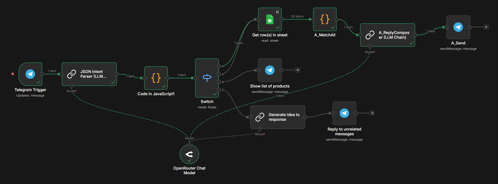

# DryVina Telegram Sales Bot

A simple AI-powered Telegram sales assistant built with **n8n + LLM API + Google Sheets**.

This project started as a personal attempt to automate a small dry food shop workflow and, at the same time, learn how LLM can be integrated into real automation systems.

## 📌 Why I Built This

I wanted to learn:

- How to connect Telegram with LLM through API
- How to structure user messages into reliable data (intent + products)
- How to avoid depending completely on free-text LLM responses
- How to combine AI with simple rule-based logic

## 🔄 System Architecture

Basic flow:

1. Telegram receives user message
2. LLM converts the message into structured JSON (intent + products)
3. Custom JavaScript logic matches products with inventory
4. LLM generates a natural reply using validated data
5. Telegram sends the final response back

## 🧩 Main Components

| Component | Purpose |
|-----------|----------|
| Telegram Trigger | Receives incoming messages |
| JSON Intent Parser (LLM) | Extracts structured data from user input |
| Matching Engine (Custom JS) | Matches requested product with inventory |
| Google Sheets | Stores product stock data |
| AI Reply Composer | Generates friendly response text |
| Telegram Sender | Sends reply to user |

## 🧠 What I Tried to Explore

### 1️⃣ Structured Intent Extraction

Instead of asking LLM to directly respond,
I force it to return JSON with:

- intent (buy / check_stock / list_products / other)
- product names
- quantities

This makes the next steps more predictable.

### 2️⃣ Hybrid Logic (LLM + Rule-based)

LLM is used for:
- Understanding user language
- Generating natural responses

Rule-based logic is used for:
- Product normalization
- Similarity matching (Jaccard-based scoring)
- Threshold validation
- Preventing incorrect product matches

This approach helps reduce hallucination
and keeps the business logic under control.

### 3️⃣ Text Normalization Challenges

Since input is in Vietnamese, I had to:

- Normalize diacritics
- Remove quantity/unit noise
- Handle slightly different product names

This part helped me understand how messy real user input can be.
